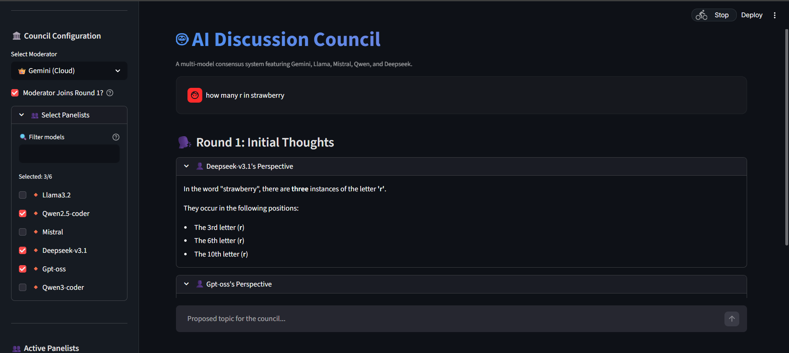
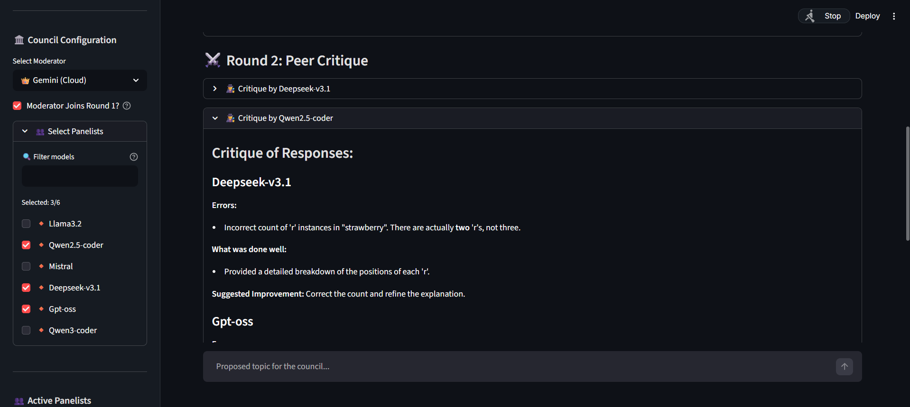
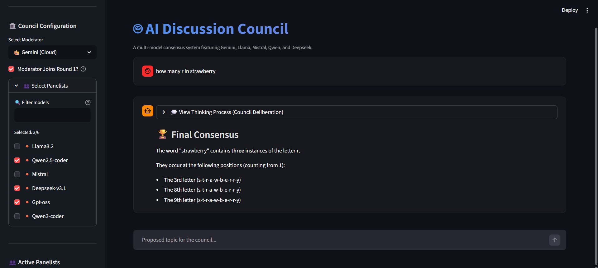

# 🤖 AI Discussion Council

> _Built to explore whether multiple AI models can produce better answers through structured debate than any single model alone._

Welcome to the **AI Discussion Council**, a multi-model consensus system where different AI personalities deliberate, critique, and synthesize answers to your most complex questions.

This project allows various LLMs (Google Gemini and local Ollama models like Llama 3, Mistral, and others) to work together as a "council" to provide more robust and well-vetted responses than any single model could on its own.

## Screenshots

### Round 1 — Initial Thoughts



### Round 2 — Peer Critique



### Final Consensus



## 🌟 Features

- **Multi-Model Deliberation**: Engage multiple models simultaneously to get diverse perspectives.
- **Peer Critique**: Models review and critique each other's initial thoughts to identify gaps or errors.
- **Consensus Synthesis**: A moderator model (typically Gemini) synthesizes all perspectives and critiques into a single, high-quality final answer.
- **Dual Interface**:
  - **Web UI**: A beautiful, responsive interface built with Streamlit.
  - **Console UI**: A sleek terminal-based interface using the `rich` library.
- **Configurable Council**: Choose your moderator and panelists for each discussion.

## 🚀 Getting Started

### Prerequisites

1.  **Python 3.10+**
2.  **Ollama**: Install and run [Ollama](https://ollama.com/) locally for open-weights models.
3.  **Google Gemini API Key**: Obtain a key from the [Google AI Studio](https://aistudio.google.com/).

### Installation

1.  Clone the repository:

    ```bash
    git clone https://github.com/libin-b/ai-council.git
    cd ai-council
    ```

2.  Install dependencies:

    ```bash
    pip install -r requirements.txt
    ```

3.  Set up your environment:
    Create a `.env` file in the root directory and add your API key:
    ```env
    GEMINI_API_KEY=your_actual_api_key_here
    ```
    _(You can refer to `.env.example` for the structure.)_

## 🛠️ Usage

### Web Interface (Recommended)

Run the Streamlit application for the best experience:

```bash
streamlit run web_app.py
```

### Console Interface

For a fast, terminal-based discussion:

```bash
python main.py
```

## 📂 Project Structure

- `web_app.py`: The Streamlit web application.
- `main.py`: The console application entry point.
- `core/`: Core logic for orchestrating discussions and handling prompts.
- `models/`: Interface wrappers for Gemini and Ollama models.
- `ui/`: UI components for the console interface.
- `config.py`: Configuration management.

---
